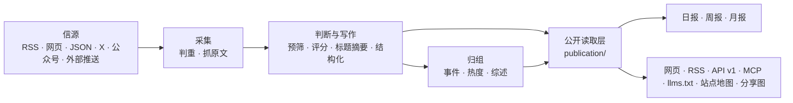

# 架构



## 三个进程

| 进程 | 位置 | 做什么 |
|---|---|---|
| api | `apps/api/` | Fastify。网站自用接口（`/api/site/`）、公开 API（`/api/v1/`）、RSS、MCP、后台接口、图片代理、分享图 |
| worker | `apps/worker/` | pg-boss 任务队列和定时任务：抓信源、调模型、归组、热度、日报、告警、清理 |
| web | `apps/web/` | React Router 服务端渲染的网页。只通过 HTTP 读 api，不碰数据库 |

业务代码都在 `packages/backend/`，前后端共用的类型和常量在 `packages/contracts/`。这个站自己的名字、文案、品牌和页面在 `site/`，行业的分类、信源、提示词和门槛在 `industry/`，只属于这个站的功能在 `modules/`（见下文“模块”）。

## 几条不变的规则

- **一个公开读取层**：网页、RSS、API、MCP、站点地图、分享图读的都是 `packages/backend/src/publication/`。公开范围、精选席位（机器出口每条新闻只出一条）与事实证据条件只在 `publication/scope.ts` 定义；新增出口也遵循当前的撤回和全文许可。
- **页面不调模型**：读者打开页面只读数据库里已经有的结果；模型只在 worker 的任务里调用。
- **花钱的请求有回执**：每个付费请求（模型、X、公众号、Jina）先记一张回执，拿到结果先存再用。进程重启、任务重试时，复用已经付过钱的结果，不重复花钱（`providers/receipts.ts`）。结果不明的回执超过 30 分钟后自动放行一次；因它停在失败状态的文章会重新入队，继续未完成的正文提取或分析。再次结果不明时，由管理员在“运行”页核对后放行。
- **预算熔断**：每个付费服务有每分钟、每小时、每天的上限，超过就暂停（后台“设置 → 付费请求上限”）。
- **安全阀**：`COLLECT_ENABLED`、`MODEL_CALLS_ENABLED`、`FEISHU_CONTENT_PUSH_ENABLED`、`FEISHU_INTERNAL_ENABLED`、`INDEXNOW_SUBMIT_ENABLED` 只决定“发不发出去”，不决定走哪套逻辑；只有设成 `true` 才打开。开发时关着；测试里推送一直关着，采集和模型调用只连本地假服务。
- **公开内容匿名**：管理员和访客看到的一样；读者的收藏、已读存在浏览器里。后台只允许管理员。
- **旧文不刷屏**：发现时已发布超过 48 小时的资料、新信源的存量、回灌的推送，按原文时间归档，不进“今天”、不推送。
- **报告空窗口可观测**：到期窗口没有合格素材或日报时，不发布空报告；定时任务在回执的 `skipped` 中记录 `no_selected_items` / `no_daily_entries`，下一周期继续检查，不触发失败重试。显式人工生成仍返回缺材料错误，真实模型、数据库或保存故障仍失败并重试。
- **来源可追溯**：每条精选都链接原文；站内是否显示全文由信源的 `site_fulltext` 决定，默认只显示摘要。
- **规则由所属模块维护**：后台调用内容、事件、通知与恢复模块，不直接改写它们的状态；业务模块不反过来依赖后台。人工修改、公开结果与恢复所需记录一起提交。
- **跨进程接口共享类型**：后台接口以 `packages/contracts/src/admin.ts` 为准，任务载荷以 `jobs/queue.ts` 的 `JobData` 为准，发送方和接收方一起检查。前端仍只通过 HTTP 访问后端。

这些模块边界由 `tests/architecture.test.ts` 检查；调整边界时同时更新约定与检查。站点身份和每一步的模型从 `site/` 读，行业分类和提示词从 `industry/` 读，代码里不写死某个站的值。

## 目录

| 位置 | 内容 |
|---|---|
| `site/` | 这个站自己的：站名文案、每一步的模型、品牌与 Logo、条款页、原样发布的根目录文件、更新日志，以及启用哪些模块（`site/modules/`） |
| `industry/` | 行业包：分类标签、主题、示范信源、提示词、门槛 |
| `modules/` | 只属于这个站的功能，一个功能一个文件夹（见下文“模块”）；框架本身不带模块 |
| `packages/backend/src/sources/` | 六种信源的读取器，抓取调度（`collect.ts`） |
| `packages/backend/src/content/` | 资料入库、判重、正文提取和清洗 |
| `packages/backend/src/editorial/` | 判断与写作：`analyze.ts`（流程）、`prompts.ts`（读提示词）、`models.ts`（每一步用哪个模型） |
| `packages/backend/src/events/` | 事件归组、热度、事件综述 |
| `packages/backend/src/publication/` | 公开读取层 |
| `packages/backend/src/reports/` | 日报、周报、月报 |
| `packages/backend/src/providers/` | 模型、向量、X、公众号、Jina 的调用，回执与预算 |
| `packages/backend/src/notify/` | 飞书推送 |
| `packages/backend/src/operations/` | 告警、备份、清理、IndexNow |
| `packages/backend/src/admin/` | 后台接口 |
| `apps/web/app/routes/` | 每个页面一个文件，`routes.ts` 是路由表 |
| `database/migrations/` | 数据库迁移，按编号顺序执行 |
| `scripts/` | 初始化、迁移、种子数据、评测、检查脚本 |
| `tests/` | 后端测试（数据库名必须以 `_test` 或 `_ci` 结尾，见下文） |

## 模块

框架里没有、只有你这个站要的功能（比如一个专门的榜单或监控页），做成模块：一个功能一个文件夹 `modules/<名字>/`，是一个名为 `@aihot/<名字>` 的 npm 包，装着它自己的后端、接口、页面、样式、数据库迁移和测试。

| 文件 | 内容 |
|---|---|
| `module.ts` | 它的地址：页面、跳转、交给 api 处理的路径（类型见 `packages/contracts/src/modules.ts`） |
| `server.ts` | 它接进后端的插口：接口、定时任务、队列、事件回调、后台页面的数据等（`packages/backend/src/modules.ts`，每个插口注明读它的文件） |
| `web.tsx` | 它接进网页的插口：页面、导航项、主题页与后台的部件等（`apps/web/app/modules.ts`）；只在某一页出现的部件给出加载函数，随那一页的代码加载 |
| `migrations/` | 它自己的表，和 `database/migrations/` 一起按文件名排序执行 |
| `tests/` | 它的测试，`npm test` 一起跑 |

写好以后在 `site/modules/` 的三份清单里列上它：`index.ts` 列地址，`server.ts` 列后端，`web.ts` 列网页，没有的那份不列；再在 `site/package.json` 的 `dependencies` 里写上它。用 Docker 部署的，在 `Dockerfile` 里照着其他包加一行 `COPY modules/<名字>/package.json modules/<名字>/`。框架的代码不导入任何模块，只读这三份清单，所以合并本仓库以后的更新时，不容易和你自己的功能冲突。插口不够用时，在框架里加一个通用的插口，而不是把这个功能写进框架。

## 对外出口

| 地址 | 内容 |
|---|---|
| `/` `/all` `/hot` `/topics` `/daily` `/weekly` `/monthly` | 精选、全部动态、热门事件、主题、日报周报月报 |
| `/feed.xml` `/feed/full.xml` `/feed/all.xml` `/feed/daily.xml` `/feed/weekly.xml` `/feed/monthly.xml` | RSS：精选、精选全文、全部、日报、周报、月报；另有按分类的 `/feed/category/<key>.xml` |
| `/api/v1/` | 公开 API，文档在 `/openapi-v1.json`；给 Agent 读的 Markdown 从 `/api/v1/agent` 开始；说明页在 `/agent` |
| `/api/mcp` | MCP 服务：最新、搜索、热点、事件、日报、周报、月报各一个工具，工具名前缀是 `site/site.ts` 的 `mcpPrefix` |
| `/llms.txt` `/sitemap.xml` `/robots.txt` | 给大模型和搜索引擎的说明（`robots.txt` 等根目录文件在 `site/public/`） |
| `/admin` | 后台 |

## 测试

```bash
npm run typecheck
DATABASE_URL=postgres://127.0.0.1:5432/myhot_test npm test
npm run build -w @aihot/web && node --test apps/web/tests/*.test.ts
```

`DATABASE_URL` 指向的库名必须以 `_test` 或 `_ci` 结尾；没有会自动创建并迁移。每个测试文件在它的一份副本上并行运行，所以数据库账号要有建库权限（`CREATEDB`）。测试不访问任何外部服务：模型和付费接口都由本地假服务回答。
